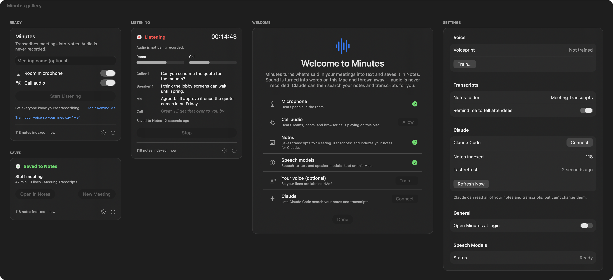

# Minutes

A Mac menu bar app that turns meetings into text in Apple Notes — without ever recording audio — and lets Claude Code search your notes and transcripts.



## Features

- **Listens, never records.** Speech is turned into text in memory on this Mac and discarded. A build check forbids audio-file APIs, and `scripts/audit-writes.sh` proves no audio reached the disk.
- **Room and calls.** Hears the room through the Mac microphone (with echo cancellation) and Teams, Zoom, or browser calls playing on the Mac.
- **Who said what.** Your lines are labeled "Me" after a 30-second voice training; others become Speaker 1, 2… (room) and Caller 1, 2… (call).
- **Saved to Notes.** Each meeting becomes a note in your iCloud "Meeting Transcripts" folder, updated every 30 seconds, so it syncs to your iPhone and iPad.
- **Claude can search it.** Minutes keeps a private search index of all your notes' text and serves it to Claude Code, read-only.
- **Apple native.** Menu bar panel, Liquid Glass controls, light and dark mode.

## Requirements

- macOS 26 or later, Apple Silicon
- Apple Notes with an iCloud account
- Claude Code (optional, for searching notes with Claude)
- Internet once, to download the speech and speaker models

## Installation

1. Download the latest `Minutes-<version>.zip` from Releases.
2. Unzip it and move **Minutes** to Applications.
3. Open Minutes once. If macOS blocks it, go to **System Settings > Privacy & Security** and click **Open Anyway**.
4. Work through the Welcome checklist: microphone, call audio, Notes, speech models, your voice (optional), and Claude.

## Usage

1. Click the waveform in the menu bar.
2. Optionally type a meeting name, then click **Start Listening**. Tell the people in the meeting you're transcribing.
3. While listening, the menu bar shows a red dot and the elapsed time.
4. Click **Stop**. The transcript is in Notes under **Meeting Transcripts**; click **Open in Notes** to see it. If Notes couldn't save it, click **Try Again** or **Copy Transcript** — Minutes keeps it until you do.
5. In Claude Code, ask things like "What did we decide about the lobby screens in Tuesday's meeting?"

## Configuration

Open **Settings** from the gear in the menu bar panel:

| Setting | What it does |
|---|---|
| Voice | Train, retrain, or delete your voiceprint (192 numbers; can't be played back) |
| Notes folder | Where transcripts go (default "Meeting Transcripts") |
| Remind me to tell attendees | Shows a reminder under Start |
| Claude Code | Connects the search server: `claude mcp add minutes --scope user -- /Applications/Minutes.app/Contents/MacOS/Minutes --mcp` |
| Open Minutes at login | Keeps the notes index fresh for Claude |
| Check for updates automatically | Minutes updates itself; it never checks or relaunches during a meeting |

## Hermes Helper (the assistant Mac mini)

The repo also builds **Hermes Helper**, a background app with no windows for the always-on assistant Mac mini. It keeps its own search index of the Mac's Apple Notes (the same engine as Minutes) and serves it read-only to [Hermes Agent](https://github.com/NousResearch/hermes-agent) over MCP, so Hermes can answer questions from your notes and meeting transcripts. Install with `bash scripts/deploy-helper.sh` (builds, copies over SSH, registers a launchd agent); click Allow once when macOS asks to let Hermes Helper control Notes. Design: [docs/superpowers/specs/2026-10-07-hermes-helper-design.md](docs/superpowers/specs/2026-10-07-hermes-helper-design.md).

## Privacy

- Stored on this Mac: `~/Library/Application Support/Minutes/notes-index.db` (a text-only search index of your notes) and `voiceprint.json` (if trained). Models live in `~/Library/Application Support/FluidAudio/Models`.
- Stored in iCloud: the transcript notes, like any other note.
- Never stored anywhere: audio.
- macOS can page app memory to its encrypted swap file under memory pressure; swap is encrypted with a per-boot key.
- Illinois law (720 ILCS 5/14-2) treats secretly recording or transmitting a private conversation as eavesdropping. Tell attendees you're transcribing. This is not legal advice.

To check for yourself: run `bash scripts/audit-writes.sh start`, hold a short meeting, then `bash scripts/audit-writes.sh report`.

## Building from source

```bash
git clone https://github.com/NorthwoodsCommunityChurch/avl-minutes.git && cd avl-minutes
bash scripts/build-and-run.sh          # fetches FluidAudio, generates the project, builds, installs, launches
swift test --package-path Packages/MinutesKit
```

Requires Xcode 26 and XcodeGen (`brew install xcodegen`).

Diagnostics (run from Terminal):

```bash
bash scripts/mcp-smoke-test.sh                                        # search server answers
MINUTES_TRACE=1 /Applications/Minutes.app/Contents/MacOS/Minutes --transcribe-check   # plays two voices, prints the transcript
/Applications/Minutes.app/Contents/MacOS/Minutes --audio-check        # mic vs. call levels (echo cancellation)
```

## Project structure

```
Minutes/                 App: audio capture, pipeline, Notes bridge, Claude connector, SwiftUI
  App/  Audio/  Pipeline/  Notes/  Claude/  UI/
Packages/MinutesKit/     Tested core: attribution, speakers, transcript + timeline, Notes index, MCP tools + server, child-process runner
Packages/AudioDeps/      Wraps the vendored FluidAudio (Vendor/, fetched by scripts/fetch-deps.sh)
scripts/                 build-and-run, fetch-deps, no-audio guard, audit-writes, mcp-smoke-test
docs/                    Design spec, implementation plan, screenshots
DESIGN.md                Visual design (Apple native)
```

## License

MIT — see [LICENSE](LICENSE).

## Credits

See [CREDITS.md](CREDITS.md).
